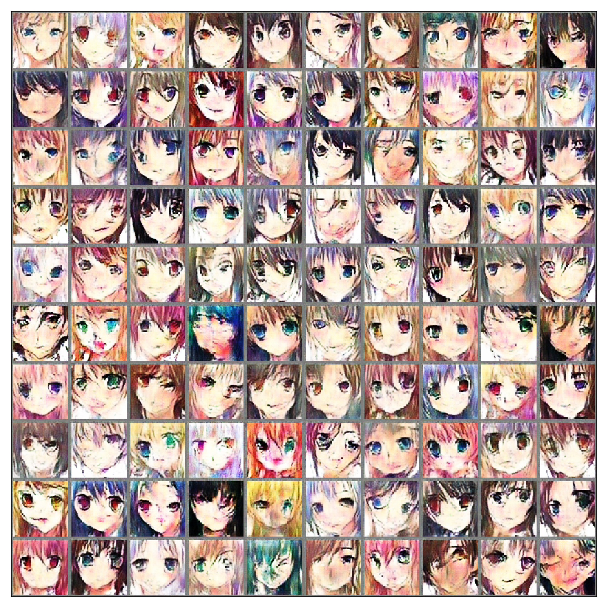

Wassertein Generative Adversarial Network(WGAN)
===
This is simple demo of Wassertein GAN on Anime dataset. The model need around 20000 iterations to get reasonable result. The running time could be around 3 hours on GTX 1070 GPU.

## Data
===
Anime Data that crawled from Japanese Anime Websites randomly and preprocessed through anime face detection code, for example [lbpcascade](https://github.com/nagadomi/lbpcascade_animeface). I collected around 20000 images as training data. Please do not ask me for sharing the data due to potential copyright issue.

## Stability
Before using Wassertein GAN, I tried multiple hacking technology such as [mini-batch discrimination](https://arxiv.org/pdf/1606.03498.pdf) and [tricks](https://github.com/soumith/ganhacks). But, unfortunately, none of them really works in general but really depends on how lucky you are.

## Demo

